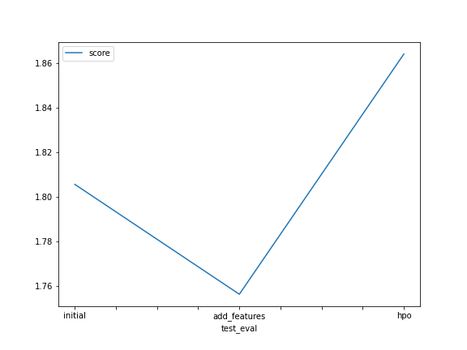

# Report: Predict Bike Sharing Demand with AutoGluon Solution
#### Pubudu De Alwis

## Initial Training
### What did you realize when you tried to submit your predictions? What changes were needed to the output of the predictor to submit your results?
When I tried to submit my predictions to keggle I relize that keggle was not there as a command in the current sagemaker project therefore I had to install keggle using pip -U install kaggle and then create a symbolic link to /usr/bin/kaggle using /root/.local/bin/kaggle.
To submit a result in to kaggle using predictor we need to predict the count using test.csv dataset by using *predictor.predict(test)*

### What was the top ranked model that performed?
WeightedEnsemble_L3

## Exploratory data analysis and feature creation
### What did the exploratory analysis find and how did you add additional features?
With the use of Sagemaker Data wrangler EDA is done and found that using Featurized Date/Time transformation we can further devide the datetime field into year, month and date to add these features to do current dataframe first the datetime field in the dataframe is converted into pandas datetime fromat and then extract the year, month and day values using dt.
```
train["year"] = train["datetime"].dt.year
train["month"] = train["datetime"].dt.month
train["day"] = train["datetime"].dt.day
test["year"] = test["datetime"].dt.year
test["month"] = test["datetime"].dt.month
test["day"] = test["datetime"].dt.day
```

### How much better did your model preform after adding additional features and why do you think that is?
When add the new features to the dataset the r2 value is increased from 0.914821 to 0.914850. Therefore, model performance has been increased with the test dataset

## Hyper parameter tuning
### How much better did your model preform after trying different hyper parameters?
According to the kaggle score the hyperparameter model with num_bag_folds=0, num_bag_sets=20 and num_stack_levels=0 has improved the intial raw submission score 1.80775 to 1.86412

### If you were given more time with this dataset, where do you think you would spend more time?
Do to the exploratary data analysis to get more insight about the provided dataset and improve it by catergorizing  data and adding more features using current features.

### Create a table with the models you ran, the hyperparameters modified, and the kaggle score.
|model|net_bag_folds|net_bag_sets|net_stack_levels|score|
|--|--|--|--|--|
|initial|0|1|0|1.80775|
|add_features|0|1|0|1.74994|
|hpo|0|20|0|1.86412|

### Create a line plot showing the top model score for the three (or more) training runs during the project.


### Create a line plot showing the top kaggle score for the three (or more) prediction submissions during the project.



## Summary

With the use of autogluon we can train different ML algorithms and then we are able to get the best perform ML algorithm for the training dataset which reduce lot of workload that MLE spend when selecting an best ML algorithms to train their dataset which provide better performance. In this project bike sharing demand kaggle competetion has been done using the autogluon with inital row dataset, adding new features and then modifying hyperparameters of the autogluon and able to achieve kaggle scores as follow;
* Initial - 1.80775
* Add_features - 1.74994
* Modifying hyperparameters - 1.86412
With modifying hyperparameters with adding new features the Kaggle score has significant improvement.